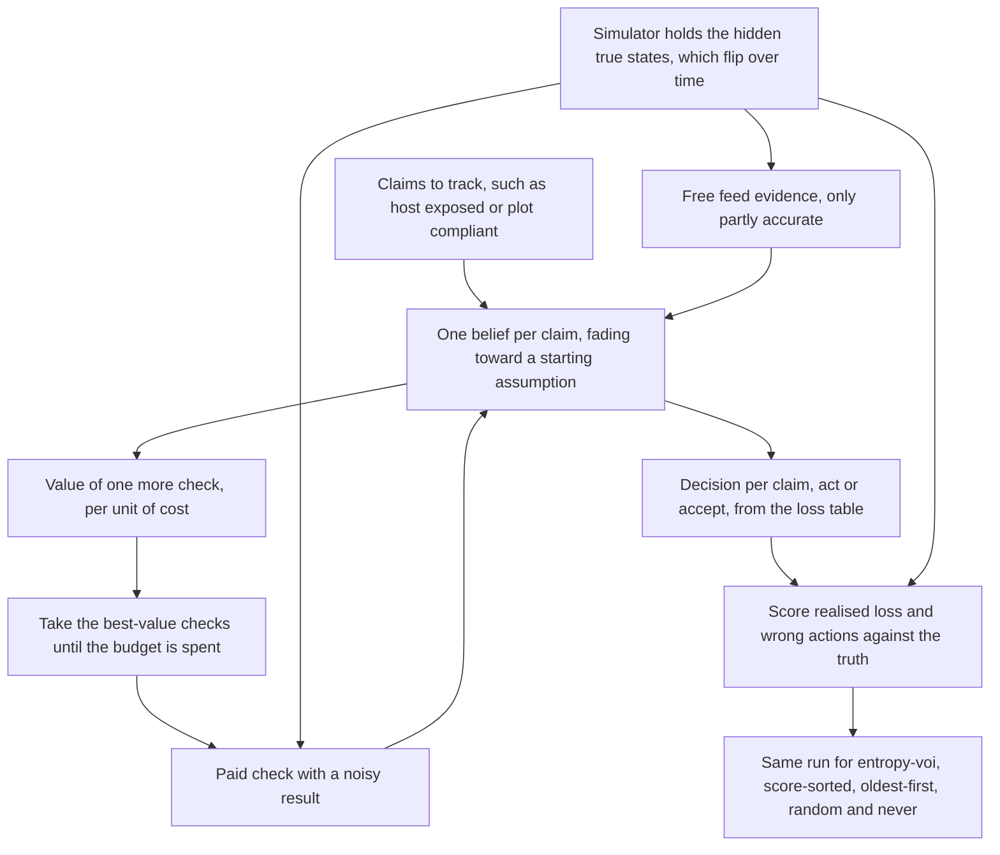
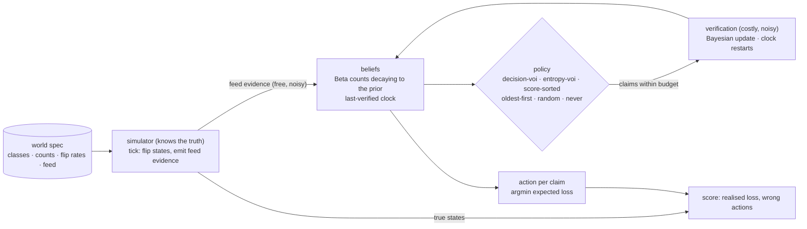

# SENTINEL

**Verification scheduling under freshness decay.** When there are more claims than capacity to check them, which one should be verified next, given that beliefs go stale, feed evidence is free and noisy, and a real check costs money?

  [](https://github.com/gandhiashutosh14/sentinel-verify/actions/workflows/ci.yml) 

---

> **In plain English:** Security and compliance teams have far more findings than they can re-check, and old, confident findings quietly go stale. SENTINEL is a Python simulation prototype that tests one way to pick the next check: the one most likely to change a decision, per unit of cost. On two invented worlds, with no real system involved, it had the lowest average loss when checks were scarcest but lost to other rules when checks were plentiful.
>
> **Reading guide:** business readers can read the next three sections, then jump to [SWOT](#swot-analysis) and [where this applies](#where-this-applies). Engineers can go straight to [The problem, and what is implemented](#the-problem-and-what-is-implemented).

## The problem in plain English

*Illustrative example:* six months ago, a scan found one of a company's servers open to the internet, and an analyst confirmed it. Nobody has checked since. The server may have been fixed, or it may still be exposed, but the record still says "confirmed" and the team still acts on it. Many other findings are in the same state, and the team can re-check only a few each day. Which ones should it pick?

Compliance work has the same shape. A programme may need to confirm that farm plots or suppliers follow a rule. A field visit gives a reliable answer but costs money. Satellite-style signals and other feeds arrive for free, but they are only moderately accurate. Nobody can visit everyone.

Two common shortcuts each miss something. Checking the highest-risk items first ignores that many of those answers are already settled: a new check would not change what the team does. Checking the oldest items first ignores whether the answer matters at all. SENTINEL tests a third rule. For each claim, estimate how much one more check would reduce the expected cost of wrong decisions, divide by the price of the check, and spend the budget on the best ratios. Decision analysts call this the *value of information* (VOI).

In the simulation, each belief is a Beta distribution: a curve over "how likely is this claim to be true". Confidence fades back toward a starting assumption as time passes. Free feed evidence nudges the belief, but only a paid check resets the "last verified" clock. Only the simulator knows the true answers, and it scores every policy's decisions against them.

## Executive summary

| Question | Answer |
|---|---|
| What problem does this address? | Choosing which finding or claim to re-check next when checks cost money, confidence fades with time, and there are far more claims than checks. |
| Who has this problem? | Attack-surface and vulnerability management teams, security operations, compliance and audit programmes, supply-chain assurance teams, and anyone who maintains a large list of facts that change. |
| What does this repository do? | Simulates claims whose true state flips over time, keeps an ageing belief for each, and compares six scheduling rules on the same budget. The rule under test, `decision-voi`, ranks checks by expected reduction in decision loss per unit of cost. |
| What has been shown so far? | In the `exposure` world at a budget of 2 per tick, `decision-voi` had the lowest mean loss per tick: 181.59, against 194.84 for `oldest-first` and 322.54 for never checking. At budgets 5 and 10, `oldest-first` won: 130.49 against 161.93, and 103.33 against 116.40 ([`reports/exposure.md`](reports/exposure.md)). In the `field` world, `decision-voi` was lowest at budget 4 (306.33), but `entropy-voi` was lower at budgets 12 and 24: 203.43 against 220.10, and 122.87 against 130.18 ([`reports/field.md`](reports/field.md)). 10 tests cover the belief maths, budgets and determinism ([`tests/test_sentinel.py`](tests/test_sentinel.py)) and pass in GitHub Actions on Python 3.10 and 3.12 ([workflow](.github/workflows/ci.yml)). |
| How mature is it? | A simulation prototype. Two invented worlds of 200 and 180 claims, each run for 200 ticks with 20 seeds per policy. The code has no probe, scan, crawl or network access. |
| What it is not | Not a scanner, not a production scheduler, and not evidence about any real network or programme. The scheduler is greedy and looks one step ahead, so it ignores the chance that a settled claim flips; that is why it loses at larger budgets. Its lead over the runner-up at the scarcest budget is smaller than the spread across seeds. |
| What it would take to use it for real | Estimate decay rates, flip rates, loss costs and check accuracy from a team's own re-verification history; build the non-myopic value that includes flip risk; connect to the systems that run real checks, with their safety limits; and test the ranking on real data before trusting it. |

## How it works, end to end

The engineering view of the same loop is in [How the pieces fit](#how-the-pieces-fit).



1. **World.** A world file sets the claim classes, how many claims of each, how often true states flip, how much free feed evidence arrives, and the loss table ([`worlds/exposure.json`](worlds/exposure.json), [`worlds/field.json`](worlds/field.json), loaded by [`sentinel/world.py`](sentinel/world.py)).
2. **Beliefs that age.** Each claim holds a Beta belief whose counts decay exponentially toward the class prior, so an old, confident belief drifts back to the default ([`sentinel/belief.py`](sentinel/belief.py)).
3. **Two evidence channels.** Each tick, true states may flip and free feed evidence nudges some beliefs. Feed evidence never resets the last-verified clock.
4. **Decisions.** For each claim the code picks `act` or `accept`, whichever has the lower expected loss under that class's asymmetric loss table.
5. **Value of a check.** `decision_voi` computes how much one noisy check would lower the expected loss. It is exactly zero when neither possible result would change the decision.
6. **Scheduling.** Each policy ranks the claims and takes checks until the tick's budget is spent ([`sentinel/policies.py`](sentinel/policies.py)). A paid check updates the belief with Bayes' rule and restarts the clock.
7. **Scoring.** At every tick the simulator compares each claim's action with its hidden true state and adds up loss and wrong actions ([`sentinel/simulate.py`](sentinel/simulate.py)).
8. **Report.** `sentinel simulate` sweeps budgets and seeds and writes a Markdown report that records the command and revision behind it ([`sentinel/cli.py`](sentinel/cli.py), [`reports/`](reports/)).

**Worked example.** The unit tests show the rules on one small claim class ([`tests/test_sentinel.py`](tests/test_sentinel.py)): prior Beta(1, 9), decay rate 0.1 per tick, loss 1 for acting on a false claim, loss 6 for accepting a true one, and check cost 1. Here p(true) is the belief's probability that the claim is true.

| Situation in the tests | Result |
|---|---|
| Belief with counts 20 and 1 at tick 0 | p(true) is 20/21 |
| The same belief at tick 100, never re-checked | p(true) is back near the class prior of 0.1 |
| Feed evidence at tick 30, then a check at tick 30 | the feed moves the belief but leaves the last-verified clock alone; the check sets the clock to 30 |
| p(true) of 0.5, 0.05 and 0.2 | 0.5 gives `act` and 0.05 gives `accept`; at 0.2, `act` has an expected loss of 0.8 against 1.2 for `accept` |
| Settled belief with counts 1 and 200 | the decision value of a check is exactly 0, while its entropy value is above 0 |
| Borderline belief with counts 1.5 and 8.5 | the decision value is above 0, and a positive and a negative check would lead to different actions |

The full simulation follows the same logic. At a budget of 2 in `exposure`, `score-sorted` made 200 checks per run and still reached a loss of 316.33, close to never checking (322.54), because its top-ranked claims were already settled on `act` ([`reports/exposure.md`](reports/exposure.md)).

## The problem, and what is implemented

An attack-surface product tracks hundreds of millions of hostnames; a sustainability programme can visit a hundred thousand farms a year. Neither can re-check everything, and a check from six months ago is worth less than one from yesterday. Sorting by a risk score ignores staleness; re-crawling oldest-first ignores whether a check would change anything. This repository is a small, honest test bed for the alternative: **choose the next verification by how much it is expected to change a decision, per unit cost, with beliefs that decay as they age.**

Implemented, in pure Python with no dependencies:

- **Beliefs that age** (`sentinel/belief.py`): each claim holds a Beta belief whose pseudo-counts decay exponentially toward its class prior. Feed evidence nudges the counts but does not count as a verification; only a verification restarts the last-verified clock.
- **Decisions from an asymmetric loss table**: `act` or `accept`, chosen by expected loss, so acting on a false claim and accepting a true one can cost different amounts.
- **Decision-relevant value of information**: the expected reduction in decision loss from one noisy verification (known sensitivity and specificity, Bayesian posterior). It is exactly zero for a claim whose action would be the same whatever the check returned, however uncertain that claim is.
- **Six scheduling policies** on the same beliefs: `decision-voi`, `entropy-voi` (expected entropy reduction), `score-sorted` (highest belief first, like sorting by a risk score), `oldest-first` (a freshness crawl), `random`, `never`.
- **A seeded simulator** with hidden true states that flip over time, free feed evidence of limited accuracy, and a per-tick verification budget. Only the simulator knows the truth; it scores the action each belief implies at every tick.
- **Two invented worlds** (`worlds/`): `exposure` (many cheap, rarely changing findings and fewer expensive, fast-changing ones) and `field` (expensive visits where a false accusation costs more than a missed problem).

**Status: simulation prototype.** No probe, scan, crawl or network access exists in this repository. The worlds are invented and the numbers below describe those worlds only.

## Measured result

`sentinel simulate`, 200 ticks, 20 seeds per policy, mean realised decision loss per tick (lower is better; ± is the spread across seeds). Full tables with wrong-action rates and verification counts: [`reports/exposure.md`](reports/exposure.md), [`reports/field.md`](reports/field.md).

| World | Budget / tick | decision-voi | entropy-voi | oldest-first | score-sorted | random | never |
|---|---:|---:|---:|---:|---:|---:|---:|
| exposure (200 claims) | 2 | **181.6** ± 15.7 | 252.5 | 194.8 | 316.3 | 218.6 | 322.5 |
| exposure | 5 | 161.9 | 170.6 | **130.5** ± 6.7 | 305.2 | 165.2 | 322.5 |
| exposure | 10 | 116.4 | 129.0 | **103.3** ± 5.6 | 322.3 | 118.2 | 322.5 |
| field (180 claims) | 4 | **306.3** ± 18.4 | 313.8 | 330.2 | 376.1 | 327.3 | 377.1 |
| field | 12 | 220.1 | **203.4** ± 12.7 | 209.1 | 343.2 | 248.5 | 377.1 |
| field | 24 | 130.2 | **122.9** ± 11.0 | 153.2 | 309.6 | 187.5 | 377.1 |

What the table says, without spin:

- **When verification is scarce, the decision-relevant objective wins** in both worlds. It refuses to spend on claims whose action is already settled, which is exactly when that refusal matters most.
- **When there is more budget, it loses.** A plain oldest-first crawl beats it in `exposure`, and the entropy objective beats it in `field`. The reason is visible in the code: `decision_voi` is myopic. It values one check against today's decision and ignores that true states keep flipping, so it lets confidently-settled claims go unchecked for a long time while the world moves underneath them. Staleness-based and entropy-based rules re-check those claims anyway and, with budget to spare, that pays.
- **Sorting by score is barely better than doing nothing** in both worlds, because the highest-belief claims are the ones whose action is already `act`; verifying them changes nothing.
- Differences smaller than the spread across seeds are not evidence of anything.

The obvious next step follows from the failure: a non-myopic value that includes the flip hazard (the expected loss of leaving a claim unchecked over the coming interval), which should recover oldest-first's advantage at high budgets without giving up the low-budget win. It is not implemented here, and this README does not claim it works.

## Quickstart

```bash
git clone https://github.com/gandhiashutosh14/sentinel-verify.git
cd sentinel-verify
python -m venv .venv && .venv\Scripts\activate      # macOS/Linux: source .venv/bin/activate
pip install -e ".[dev]"
pytest -q                                            # 10 tests, no network
sentinel simulate --world worlds/exposure.json --budgets 2 5 10 --ticks 200 --seeds 20 --out reports/exposure.md
sentinel simulate --world worlds/field.json --budgets 4 12 24 --ticks 200 --seeds 20 --out reports/field.md
```

Each run takes under a minute on a laptop. Runs are deterministic per seed; the reports record the command and the commit that produced them.

## How the pieces fit



## Boundaries

- The decay rate, flip rates, loss table, test accuracy and feed accuracy are all inputs. In real use they would have to be estimated from re-verification history, and this repository does not do that.
- Decay is exponential toward the class prior. It is a modelling choice, not a fitted law.
- The scheduler is greedy and one-step. It does not plan verification over time and does not model the flip hazard, which is why it loses at high budgets.
- Verification is modelled as a single noisy binary test with fixed sensitivity and specificity. There are no probe safety classes or blast-radius constraints here; those belong to the systems that would run real checks.
- Two invented worlds, two hundred claims each. Nothing here measures any real network, programme or dataset.

## Prior work this sits next to

Value-of-information sensor scheduling; freshness-crawl scheduling under budgets (Cho and Garcia-Molina; Kolobov et al.); uncertainty-of-information restless bandits; Beta-Binomial belief models of compromise probability; exploit-prediction scoring (EPSS) and risk-based prioritisation products. The specific move here, valuing a check against the decision boundary rather than against entropy and treating feed and verification as different channels, is the part this repository is about. No novelty claim is made, and the measured result includes the case where the idea loses.

## Project layout

```
sentinel/belief.py     beliefs, decay, loss table, decision-VOI and entropy-VOI
sentinel/world.py      seeded simulator with hidden, flipping true states and feed evidence
sentinel/policies.py   the six scheduling policies
sentinel/simulate.py   runs, scoring, budget sweep, Markdown report
sentinel/cli.py        sentinel simulate
worlds/                the two invented worlds
tests/                 10 tests: decay, clock semantics, Bayesian update, VOI properties, budgets, determinism, CLI
reports/               committed runs with the command and revision that produced them
docs/DEVELOPMENT_NOTES.md  how this was built, including the two bugs the tests caught
```

## SWOT analysis

A SWOT analysis lists **S**trengths and **W**eaknesses (inside the project) and **O**pportunities and **T**hreats (outside it).

| | Helpful | Harmful |
|---|---|---|
| **Internal** | **Strengths**<br>• Values a check by whether it could change a decision, so it never spends on claims whose action is settled<br>• Keeps free feed evidence and paid checks apart; only a paid check resets the last-verified clock<br>• Pure Python with no dependencies, 10 tests, and seeded, repeatable runs whose reports record the command and revision<br>• Reports the budgets where the method loses alongside the ones where it wins | **Weaknesses**<br>• Simulation only, on two invented worlds; nothing measures a real network, programme or dataset<br>• Greedy and one-step: it ignores flip risk, so `oldest-first` or `entropy-voi` beat it at larger budgets<br>• Even at the scarcest budget, its lead over the runner-up is smaller than the spread across seeds<br>• Decay rates, flip rates, losses and check accuracy are inputs, not estimated from data<br>• One noisy yes-or-no check per claim, with independent errors; no probe safety classes or blast-radius limits |
| **External** | **Opportunities**<br>• Security teams already use exploit-likelihood scores such as the Exploit Prediction Scoring System (EPSS), which could supply starting beliefs<br>• Supply-chain due-diligence rules increase the number of claims organisations must verify<br>• Research on non-myopic value of information could inform the flip-risk extension the README proposes<br>• The same idea fits other costly re-checks: audits, inspections and data-quality reviews | **Threats**<br>• Established vulnerability-management and attack-surface products already rank findings and could add similar logic<br>• Real feeds can be biased or correlated, which the simulator's independent-error model does not capture<br>• Real loss costs are hard to agree on, and the ranking depends on them<br>• Legal and contractual limits on scanning, and access limits on site visits, cap how many real checks can run |

**Bottom line.** SENTINEL is a small, transparent test bed for one scheduling idea. It shows where decision-based value helps (when checks are scarce) and where it falls short (when checks are plentiful and the world keeps changing). Real use would need its inputs estimated from real re-verification history.

## Where this applies

The rows below are illustrative fits for the approach; none describes a documented deployment.

| Industry | Example use case | What this project's approach contributes |
|---|---|---|
| Cybersecurity (attack-surface management) | Deciding which internet-facing findings to re-check today | Re-checks a finding only when a new result could change the response, and lets stale confident findings drift back toward "unsure" |
| Vulnerability management | Choosing which systems to re-verify after patch reports | Combines a free risk feed with paid checks without treating the feed as a verification |
| Agricultural supply chains | Choosing which farm plots or suppliers to visit this season | Weighs a false accusation against a missed problem with an asymmetric loss table |
| Financial compliance | Choosing which customer records to re-review | Values a review by the decision it could change, not by record age alone |
| Food safety and manufacturing | Choosing which suppliers or production lines to inspect | Spends a fixed inspection budget where it most reduces expected loss |
| Data quality | Choosing which reference records to re-verify | Treats confidence in a record as something that fades over time |
| Infrastructure maintenance | Choosing which assets to inspect when sensors give cheap, noisy signals | Keeps cheap sensor signals separate from costly on-site inspections |
| Web and search indexing | Choosing which pages to re-crawl | Compares the rule with a freshness crawl and shows the budgets at which the crawl wins |

## Glossary

| Term | Plain-English meaning |
|---|---|
| Claim | A yes-or-no statement the team tracks, such as "this host is exposed" or "this plot is compliant". |
| Belief | How likely the system thinks a claim is to be true, stored as a Beta distribution. |
| Beta distribution | A curve over "how likely is this true", described by two counts that act like tallies of evidence for and against. |
| Prior | The starting belief for a class of claims before any evidence arrives. |
| Freshness decay | Old evidence counts for less as time passes, so beliefs drift back toward the prior. |
| Feed evidence | Free, frequent signals that are only partly accurate, such as scanner output or satellite-style data. |
| Verification | A paid check with known accuracy; the only thing that resets the last-verified clock. |
| Sensitivity and specificity | How often a check says "true" when the claim is true, and "false" when it is false. |
| Loss table | The cost of each kind of mistake: acting on a false claim, or accepting a true one. |
| Value of information (VOI) | How much a check is expected to reduce the cost of wrong decisions. |
| `decision-voi` and `entropy-voi` | Two ways to value a check: by the expected drop in decision loss, or by the expected drop in uncertainty (entropy). |
| Myopic (greedy, one-step) | Choosing the best move for now only, without planning for later changes. |
| Flip hazard | The risk that a claim's true state changes while nobody is checking it. |
| Tick, budget and seed | A simulated time step; the check cost allowed per step; the number that makes a random run repeatable. |

## Further reading

Background on risk scoring, freshness scheduling and the value of information.

| Resource | What it is | Why it matters here |
|---|---|---|
| [Exploit Prediction Scoring System (EPSS)](https://www.first.org/epss/) — Forum of Incident Response and Security Teams (FIRST), updated daily | A public model that estimates how likely a published vulnerability is to be exploited in the near future. | A real risk score of the kind `score-sorted` imitates, and a possible source of starting beliefs or feed evidence. |
| [Exploit Prediction Scoring System (EPSS)](https://arxiv.org/abs/1908.04856) — Jacobs, Romanosky, Edwards, Roytman and Adjerid, 2019 | Presents what it calls the first open, data-driven framework for estimating the chance that a vulnerability is exploited in the wild. | Shows how such a probability can be built from data, which SENTINEL's beliefs would need in real use. |
| [Known Exploited Vulnerabilities Catalog](https://www.cisa.gov/known-exploited-vulnerabilities-catalog) — Cybersecurity and Infrastructure Security Agency (CISA), maintained list | A public list of vulnerabilities known to have been exploited in the wild. | An example of free, high-confidence evidence that a real deployment would combine with paid checks. |
| [Web crawler: Re-visit policy](https://en.wikipedia.org/wiki/Web_crawler#Re-visit_policy) — Wikipedia | Explains freshness and age, and summarises Cho and Garcia-Molina's "Effective page refresh policies for Web crawlers" (ACM Transactions on Database Systems, 2003). | `oldest-first` imitates a freshness crawl, which beats `decision-voi` at the larger budgets in `exposure`. |
| [Staying up to Date with Online Content Changes Using Reinforcement Learning for Scheduling](https://proceedings.neurips.cc/paper_files/paper/2019/hash/ad13a2a07ca4b7642959dc0c4c740ab6-Abstract.html) — Kolobov, Peres, Lu and Horvitz, Advances in Neural Information Processing Systems (NeurIPS), 2019 | Proposes an objective and efficient algorithms, with optimality guarantees, for scheduling content refreshes even when change rates are unknown at first. | Close prior work on refresh scheduling, which the README's prior-work section names. |
| [Value of information](https://en.wikipedia.org/wiki/Value_of_information) — Wikipedia | Explains the expected value of information in decision-making, and cites Ronald Howard's "Information Value Theory" (1966). | The idea `decision-voi` applies to one noisy check. |
| [Near-optimal Nonmyopic Value of Information in Graphical Models](https://arxiv.org/abs/1207.1394) — Krause and Guestrin, Conference on Uncertainty in Artificial Intelligence (UAI), 2005 | Chooses a whole set of observations at once, with a near-optimality guarantee, for problems such as sensor networks. | Related research on non-myopic value of information, the direction the README names as the next step. |
| [Beta distribution](https://en.wikipedia.org/wiki/Beta_distribution) — Wikipedia | An explainer of a common distribution for an unknown probability. | Each SENTINEL belief is a Beta distribution. |
| [Regulation on Deforestation-free products](https://environment.ec.europa.eu/topics/forests/deforestation/regulation-deforestation-free-products_en) — European Commission, regulation adopted 2023 | The Commission's overview of rules meant to ensure that products consumed in the European Union (EU) do not contribute to deforestation. | A public example of regulation that creates many supply-chain claims to verify; the `field` world is invented and does not model it. |

## License

MIT. See [LICENSE](LICENSE).
