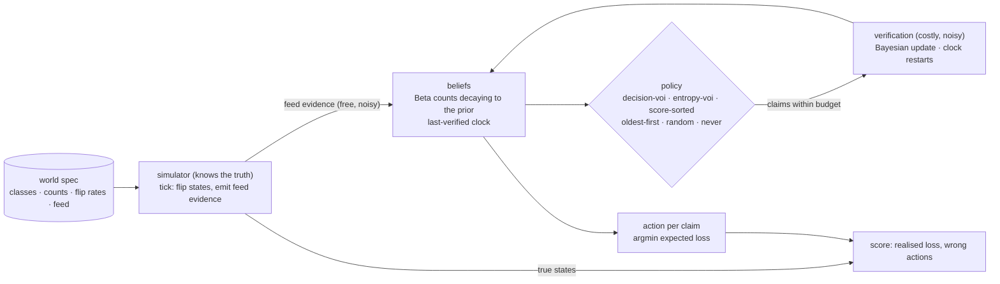

# SENTINEL

**Verification scheduling under freshness decay.** When there are more claims than capacity to check them, which one should be verified next, given that beliefs go stale, feed evidence is free and noisy, and a real check costs money?

  [](https://github.com/gandhiashutosh14/sentinel-verify/actions/workflows/ci.yml) 

---

## The problem, and what is implemented

An attack-surface product tracks hundreds of millions of hostnames; a sustainability programme can visit a hundred thousand farms a year. Neither can re-check everything, and a check from six months ago is worth less than one from yesterday. Sorting by a risk score ignores staleness; re-crawling oldest-first ignores whether a check would change anything. This repository is a small, honest test bed for the alternative: **choose the next verification by how much it is expected to change a decision, per unit cost, with beliefs that decay as they age.**

Implemented, in pure Python with no dependencies:

- **Beliefs that age** (`sentinel/belief.py`): each claim holds a Beta belief whose pseudo-counts decay exponentially toward its class prior. Feed evidence nudges the counts but does not count as a verification; only a verification restarts the last-verified clock.
- **Decisions from an asymmetric loss table**: `act` or `accept`, chosen by expected loss, so acting on a false claim and accepting a true one can cost different amounts.
- **Decision-relevant value of information**: the expected reduction in decision loss from one noisy verification (known sensitivity and specificity, Bayesian posterior). It is exactly zero for a claim whose action would be the same whatever the check returned, however uncertain that claim is.
- **Six scheduling policies** on the same beliefs: `decision-voi`, `entropy-voi` (expected entropy reduction), `score-sorted` (highest belief first, like sorting by a risk score), `oldest-first` (a freshness crawl), `random`, `never`.
- **A seeded simulator** with hidden true states that flip over time, free feed evidence of limited accuracy, and a per-tick verification budget. Only the simulator knows the truth; it scores the action each belief implies at every tick.
- **Two invented worlds** (`worlds/`): `exposure` (many cheap, rarely changing findings and fewer expensive, fast-changing ones) and `field` (expensive visits where a false accusation costs more than a missed problem).

**Status: simulation prototype.** No probe, scan, crawl or network access exists in this repository. The worlds are invented and the numbers below describe those worlds only.

## Measured result

`sentinel simulate`, 200 ticks, 20 seeds per policy, mean realised decision loss per tick (lower is better; ± is the spread across seeds). Full tables with wrong-action rates and verification counts: [`reports/exposure.md`](reports/exposure.md), [`reports/field.md`](reports/field.md).

| World | Budget / tick | decision-voi | entropy-voi | oldest-first | score-sorted | random | never |
|---|---:|---:|---:|---:|---:|---:|---:|
| exposure (200 claims) | 2 | **181.6** ± 15.7 | 252.5 | 194.8 | 316.3 | 218.6 | 322.5 |
| exposure | 5 | 161.9 | 170.6 | **130.5** ± 6.7 | 305.2 | 165.2 | 322.5 |
| exposure | 10 | 116.4 | 129.0 | **103.3** ± 5.6 | 322.3 | 118.2 | 322.5 |
| field (180 claims) | 4 | **306.3** ± 18.4 | 313.8 | 330.2 | 376.1 | 327.3 | 377.1 |
| field | 12 | 220.1 | **203.4** ± 12.7 | 209.1 | 343.2 | 248.5 | 377.1 |
| field | 24 | 130.2 | **122.9** ± 11.0 | 153.2 | 309.6 | 187.5 | 377.1 |

What the table says, without spin:

- **When verification is scarce, the decision-relevant objective wins** in both worlds. It refuses to spend on claims whose action is already settled, which is exactly when that refusal matters most.
- **When there is more budget, it loses.** A plain oldest-first crawl beats it in `exposure`, and the entropy objective beats it in `field`. The reason is visible in the code: `decision_voi` is myopic. It values one check against today's decision and ignores that true states keep flipping, so it lets confidently-settled claims go unchecked for a long time while the world moves underneath them. Staleness-based and entropy-based rules re-check those claims anyway and, with budget to spare, that pays.
- **Sorting by score is barely better than doing nothing** in both worlds, because the highest-belief claims are the ones whose action is already `act`; verifying them changes nothing.
- Differences smaller than the spread across seeds are not evidence of anything.

The obvious next step follows from the failure: a non-myopic value that includes the flip hazard (the expected loss of leaving a claim unchecked over the coming interval), which should recover oldest-first's advantage at high budgets without giving up the low-budget win. It is not implemented here, and this README does not claim it works.

## Quickstart

```bash
git clone https://github.com/gandhiashutosh14/sentinel-verify.git
cd sentinel-verify
python -m venv .venv && .venv\Scripts\activate      # macOS/Linux: source .venv/bin/activate
pip install -e ".[dev]"
pytest -q                                            # 10 tests, no network
sentinel simulate --world worlds/exposure.json --budgets 2 5 10 --ticks 200 --seeds 20 --out reports/exposure.md
sentinel simulate --world worlds/field.json --budgets 4 12 24 --ticks 200 --seeds 20 --out reports/field.md
```

Each run takes under a minute on a laptop. Runs are deterministic per seed; the reports record the command and the commit that produced them.

## How the pieces fit



## Boundaries

- The decay rate, flip rates, loss table, test accuracy and feed accuracy are all inputs. In real use they would have to be estimated from re-verification history, and this repository does not do that.
- Decay is exponential toward the class prior. It is a modelling choice, not a fitted law.
- The scheduler is greedy and one-step. It does not plan verification over time and does not model the flip hazard, which is why it loses at high budgets.
- Verification is modelled as a single noisy binary test with fixed sensitivity and specificity. There are no probe safety classes or blast-radius constraints here; those belong to the systems that would run real checks.
- Two invented worlds, two hundred claims each. Nothing here measures any real network, programme or dataset.

## Prior work this sits next to

Value-of-information sensor scheduling; freshness-crawl scheduling under budgets (Cho and Garcia-Molina; Kolobov et al.); uncertainty-of-information restless bandits; Beta-Binomial belief models of compromise probability; exploit-prediction scoring (EPSS) and risk-based prioritisation products. The specific move here, valuing a check against the decision boundary rather than against entropy and treating feed and verification as different channels, is the part this repository is about. No novelty claim is made, and the measured result includes the case where the idea loses.

## Project layout

```
sentinel/belief.py     beliefs, decay, loss table, decision-VOI and entropy-VOI
sentinel/world.py      seeded simulator with hidden, flipping true states and feed evidence
sentinel/policies.py   the six scheduling policies
sentinel/simulate.py   runs, scoring, budget sweep, Markdown report
sentinel/cli.py        sentinel simulate
worlds/                the two invented worlds
tests/                 10 tests: decay, clock semantics, Bayesian update, VOI properties, budgets, determinism, CLI
reports/               committed runs with the command and revision that produced them
docs/DEVELOPMENT_NOTES.md  how this was built, including the two bugs the tests caught
```

## License

MIT. See [LICENSE](LICENSE).
